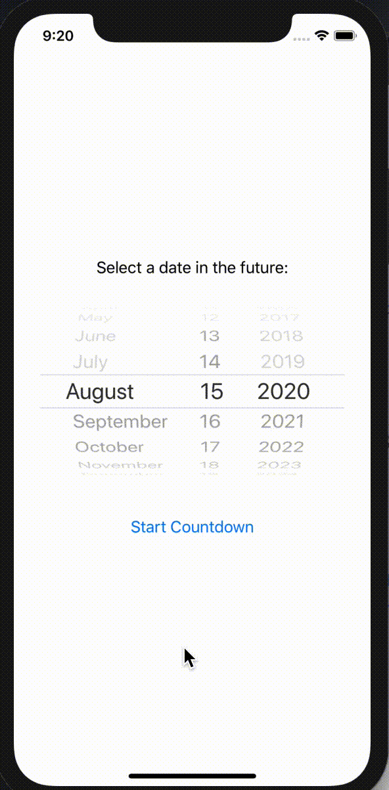

# 100Apps-07CountdownTimer

App 7 of my 100 App Challenge - https://github.com/Whoopinstick/100AppsChallenge

07 - Countdown Timer

Written in Swift / SwiftUI  
Working with Dates, Calendar, DateComponent  
Calculation of time between dates  
DateComponents playground from Sean Allen  

